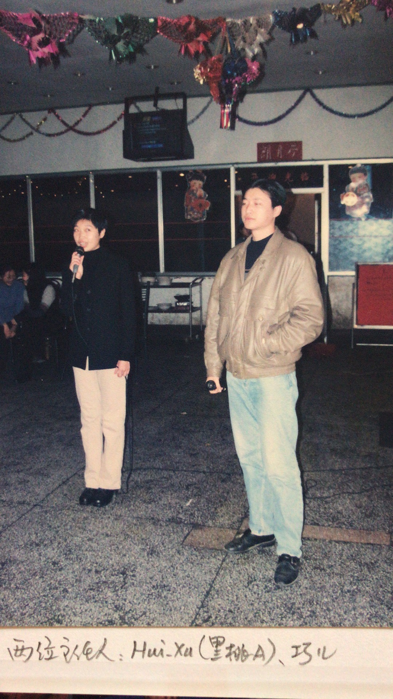
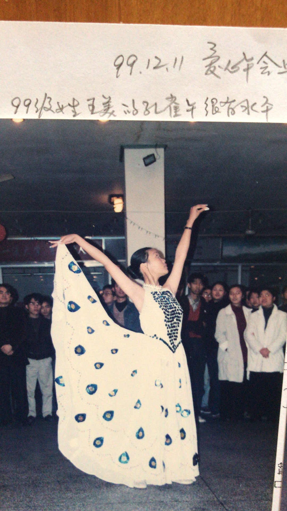
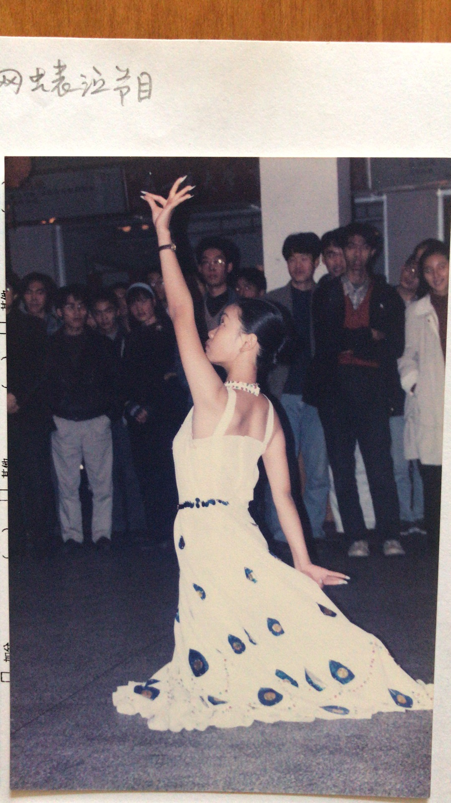
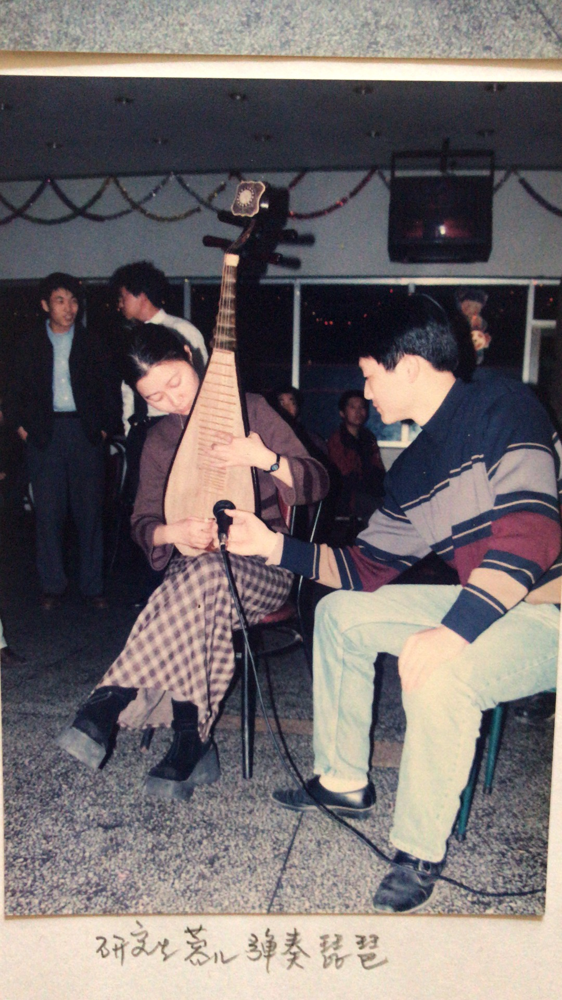
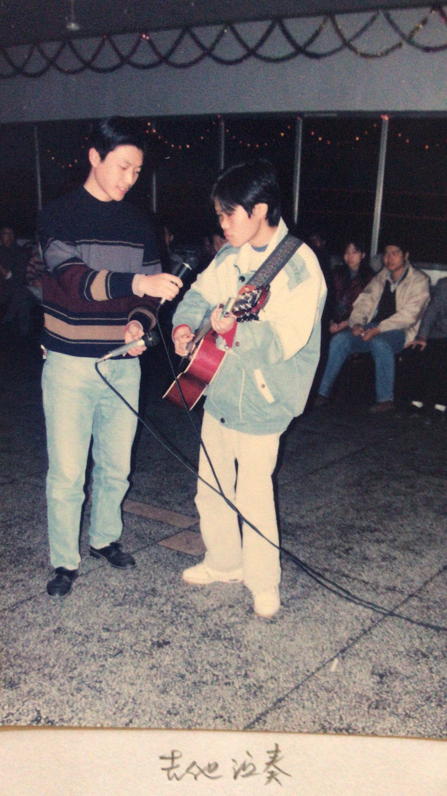
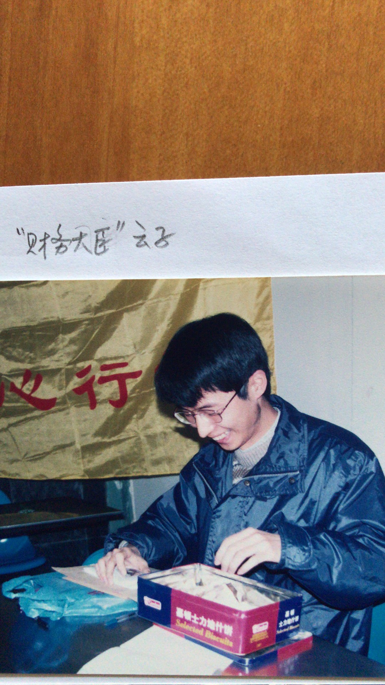
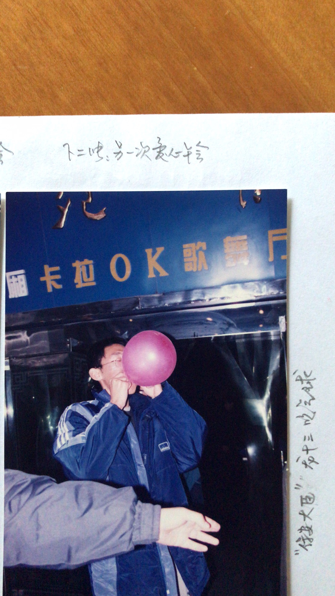
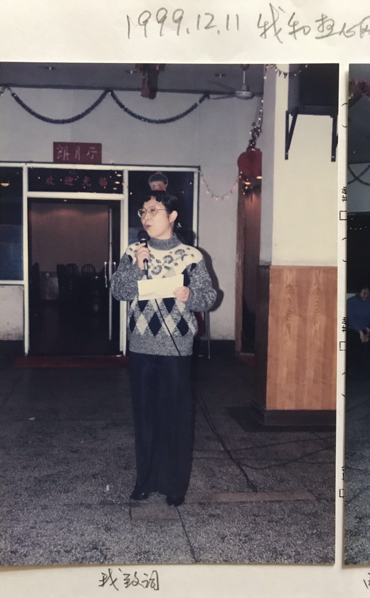

```

发信人: Rh_Qian (冰糖)，原信区: ustcbbs 
标  题: 爱心之花，盛开东苑 
发信站: 中国科大BBS站 (Tue, 14 Dec 1999 01:29:55)，站内信件 

这是才写的一篇广播稿，先在茶馆贴出来，为爱心行动呐喊， 
顺便也涨封信，圆圆莫怪！:) 


                 爱心之花，盛开东苑 
                     ----记"千禧年爱心舞会" 


    12月11日晚，东苑餐厅张灯结彩、音乐阵阵，一片喜庆。餐厅门口高挂着"中 
国科技大学爱心行动"的黄底红字大旗。这里正在举办盛大的"爱心舞会"，迎接即 
将到来的新世纪，庆祝"爱心行动"开展两周年。 
    爱心行动被誉为科大自己的希望工程，她聚集了许多同学和老师的殷殷真情， 
把温暖带给我们身边经济困难的同学，鼓励他们克服暂时困难，完成学业，扬起人 
生的风帆。 
    两年来，无数同学志愿参加了爱心行动的各种活动，捐集了三万多元爱心款。 
受到资助的同学已达60多人，他们有的已经毕业离校，有的正在读研；他们有的得 
到"1+1"形式的长期资助，有的也积极投身到爱心行动中来，向其他困难的同学奉 
献一份绵薄之力。 
    爱心行动不但给予特困同学经济上的援助，更是给了他们精神上的温暖和激励。 
每一个参与爱心行动的人都在帮助别人的同时，自己也感受到快乐。科大校园里流 
淌着真情的热流。 
    在2000年，源于爱心行动而设立的"爱心奖学金"将在我校颁奖，她将更加激 
励清贫学子寒窗苦读，立志成材。 
    今年的爱心舞会比往年气氛更热烈。早在十天前，校园网BBS上就开始酝酿讨 
论，热心的志愿者们专门召开了筹备会，为舞会作了细致的准备。生活处得知爱心 
舞会的消息，立即表示大力支持，把装修后从未外借的东苑餐厅免费给我们使用。 
餐厅王经理还专门派人为我们搬桌椅、调音响。 
    七点半不到，以网虫为主的爱心行动志愿者们纷纷到场，主动寻找自己的岗位。 
精心设计的舞会门票上正面印着爱心行动的专用标志，上面盖着鲜红的印章，反面 
有科大BBS"瀚海星云"站的图案。负责财务的是统计系一位"四五连读"的博士 
生，他早早搬来了捐款箱，为准备售票的零钱还捐献了100元。 
    他们来了，有同学，有老师。很多人不会跳舞，但是为了爱心行动，他们放下 
了紧张备考的书本、毕业设计的实验，来了；他们放弃了周末的休息、繁忙的家务， 
来了。 
    科大幼儿园的李老师和她已经退休的丈夫8系蔡老师很早就为爱心行动捐款500 
元，今天她第一个买票，一下子买了20张，并且在我们的签名簿上留言。科大医院 
陈林义院长、5系杨基明等很多老师都曾为爱心行动热情捐款。天文和天体物理系吴 
自勤老师年逾七十，当天晚上上完课，满身粉笔灰、拄着拐杖也应邀来了。 
    朱清时校长听说举办爱心舞会，特地委托他的夫人给我们送来100元捐助特困 
生。朱校长夫人还兴致勃勃的参加了晚会。 
    校学生会为舞会书写和张贴了海报，还选送了精彩节目给舞会添采。XXXX同 
学自编自演的吉他弹唱充满书生气的摇滚味，蓉儿的琵琶独奏倾倒全场，YYYY同 
学的孔雀舞赢得满堂喝彩。(我不知Xdd和Ymm的姓名，请原谅啊） 
    舞会充满青春的气息，两位主持人神采奕奕、风度翩翩，他们庄重而又活泼幽 
默的主持风格可以在全国主持人电视大赛上独树一帜。场内场外网虫们欢聚交谈， 
互相介绍，昔日网上好友、争辩对手，今日才得以一睹庐山真面目，不由得欣然开 
怀。平日宽敞的东苑餐厅今夜显得如此拥挤而热闹，大家随着一曲曲DISCO、中三、 
慢四、水兵、恰恰，翩翩起舞，尽情尽兴。 
    这次"爱心舞会"的门票和捐款收入共计1462元，舞会后即存入"爱心行动" 
帐户，它将全部用于资助特困学生的学习和生活。 
    时钟已经转到10点20，最有特色的节目上场了，这就是科大BBS站四位站长 
的小合唱《真心英雄》。小合唱很快汇成了全场的大合唱，把舞会气氛推向最高潮， 
舞会在掌声中圆满结束。 
    "灿烂星空，谁是真的英雄？平凡的人们，给我太多感动。" 
    我们为爱心行动而奉献，我们为爱心行动而感动。愿科大普通师生浇灌的"爱 
心行动"之花在新的世纪里开得更加艳丽灿烂！ 
                           
                                                 1999年12月13日 

-- 
※ 来源: 中国科大BBS站 [Saloon.board@bbs.ustc.edu.cn]


```


















